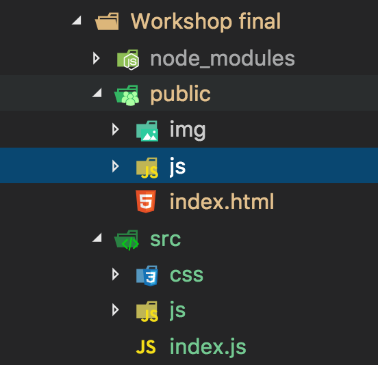
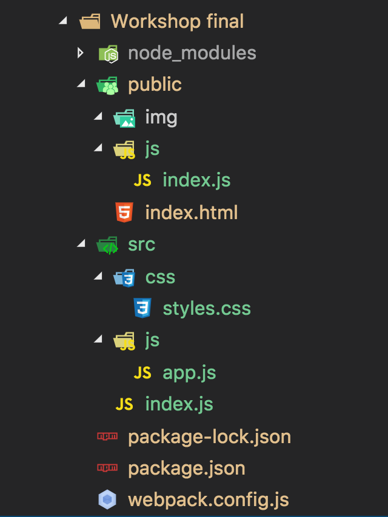

# Creación e instalación de la estructura de un proyecto SPA

## Organización de las carpetas del proyecto

Vamos a empezar a organizar nuestro proyecto para poder construir una SPA, para esto vamos a dividir nuestro proyecto en dos carpetas principales una public que va a contener lo que vamos a subir al servidor y otra src que va a tener los archivos sin procesar.



> En la carpeta public vamos a guardar el `index.html` y los archivos ya procesados de JavaScript, mientras que en la carpeta src vamos a guardar los archivos sin procesar de cada modulo de nuestro proyecto.

## Creación del package.json

Antes de empezar a instalar dependencias tenemos que generar nuestro archivo `package.json` que es el que va a contener la información de nuestro proyecto así como las dependencias del mismo. Para esto vamos a correr el siguiente comando desde la consola estando dentro de la carpeta de nuestro proyecto (en este caso Workshop final):

`npm init`

Luego de ejecutar los comandos vamos a ir completando los datos que sean necesarios si no sabemos que poner en alguno dejamos el valor por defecto, de todos modos más adelante vamos a poder modificarlos. El `package.json` debería quedar similar al siguiente:

```js
{
  "name": "workshop-final",
  "version": "1.0.0",
  "description": "Workshop final - Camada 2935",
  "main": "index.js",
  "scripts": {
    "test": "echo \"Error: no test specified\" && exit 1"
  },
  "author": "Adrian Ferre",
  "license": "ISC"
}
```

## Instalación de dependencias del proyecto

Dentro de la misma carpeta del proyecto vamos a ir corriendo comandos para poder instalar las dependencias que vamos a necesitar en nuestro proyecto.

### jQuery

Para manipular el DOM, realizar consultas AJAX y responder a los eventos vamos a utilizar la biblioteca de jQuery.

`npm install jquery`

### Boostrap

Para la parte visual vamos a utilizar Boostrap para simplificar el trabajo de maquetado y también vamos a instalar Popper que es requerido para algunos componentes, jQuery también es requerido pero lo instalamos en el paso anterior.

`npm install bootstrap@4.1.2 popper.js@^1.14.3`

> Al utilizar el `@` en la instalación nos permite seleccionar versiones especificas de los paquetes de NPM.

### Crossroads

La biblioteca Crossroads nos va a permitir crear un Router para nuestra aplicación que nos va a ayudar a manejar la navegación entre pantallas y hacer el cambio de contenido junto con jQuery.

`npm install crossroads`

### Http-server

Esta biblioteca nos va a permitir servir archivos estáticos como si fuera un servidor, sin eso el método `.load()` de jQuery no va a funcionar localmente.

`npm install http-server -g`

> El `-g` lo instala global en nuestra computadora.

### Webpack

Para poder trabajar nuestro código en distintos archivos y luego compilarlo en uno solo que sea el que importe el usuario final en la carpeta public vamos a utilizar Webpack.

`npm install --save-dev webpack webpack-cli`

> Al utilizar `--save-dev` vamos a instalarlo como una dependencia de desarrollo. Esto en el `package.json` va a quedar dentro `devDependencies`, en lugar de en `dependencies`.

### Procesador de CSS

Por último para poder importar directamente desde nuestro JavaScript los CSS tenemos que agregar los siguientes dos módulos:

`npm install --save-dev style-loader css-loader`

## Configuración

Por último vamos a agregar algunos archivos y líneas de código que nos van a permitir terminar de configurar nuestro proyecto.

### Webpack

Para terminar de configurar Webpack vamos a agregar un archivo en la carpeta de nuestro proyecto, al mismo nivel del `package.json` con el nombre `webpack.config.js` y dentro vamos a escribir el siguiente código:

```js
var webpack = require('webpack')

module.exports = {
  entry: [ __dirname + '/src/index.js' ],
  output: {
    path: __dirname + '/public/js/',
    filename: 'index.js'
  },
  module: {
    rules: [
      {
        test: /\.css$/,
        use: [ 'style-loader', 'css-loader' ]
      }
    ]
  },
  plugins: [
    new webpack.ProvidePlugin({
      $: 'jquery',
      jQuery: 'jquery'
    })
  ],
  watch: true
}
```

> Esto configura el archivo de entrada y salida para JavaScript y crea una regla para poder importar y procesar los CSS desde nuestro archivo principal.

### Package.json

En el archivo `package.json` vamos a agregar el siguiente script:

```js
  "scripts": {
    "server": "http-server",
    "start": "webpack --mode=development & npm run server",
    "build": "webpack --mode=production",
    "test": "echo \"Error: no test specified\" && exit 1"
  },
```

> Esto nos va a permitir iniciar Webpack en modo desarrollo corriendo el comando `npm start` en consola, si corremos `npm build` lo hacemos en modo producción.

## Archivos principales de nuestra aplicación

1. En src/ debemos agregar el archivo `index.js` y dentro al comienzo el código:

```js
import 'jquery'
import 'popper.js'
import 'bootstrap'
import 'bootstrap/dist/css/bootstrap.min.css'
import './js/app'
```

> Esto va a agregar Popover.js, Boostrap, sus estilos y nuestros archivos de JavaScript y CSS principales y a nuestro proyecto.

2. En src/js/ debemos agregar el archivo `app.js` que va a ser el archivo JavaScript principal de nuestra aplicación.

3. En src/css/ debemos agregar el archivo `styles.js` que va a ser el archivo CSS principal de nuestra aplicación.

4. Luego agregar en nuestro `index.html` el siguiente tag:

```html
<script src="./js/index.js"></script>
```

> Como Webpack compila todo el código en el archivo `index.js` no es necesario importar nada más.

Al final nos tiene que quedar una estructura como la siguiente:



## ¿Como usarlo?

A partir de este punto vamos a escribir nuestro código, ya sea CSS o JavaScript en los archivos ubicados en src/css o src/js y en consola vamos a dejar corriendo el comando `npm start`. Cada vez que haya un cambio en algún archivo importado en nuestro archivo `index.js` ubicado en src o en algún archivo importado por este Webpack va a volver a compilar el código y actualizar el `index.js` de la carpeta public, por lo cual con simplemente recargar nuestra página vamos a ver los cambios. Por otro lado http-server va a generar un servidor estático en http://localhost:8080/ y va a exponer en esa ruta lo que esta dentro de la carpeta public, por defecto ejecutando el `index.html`.
