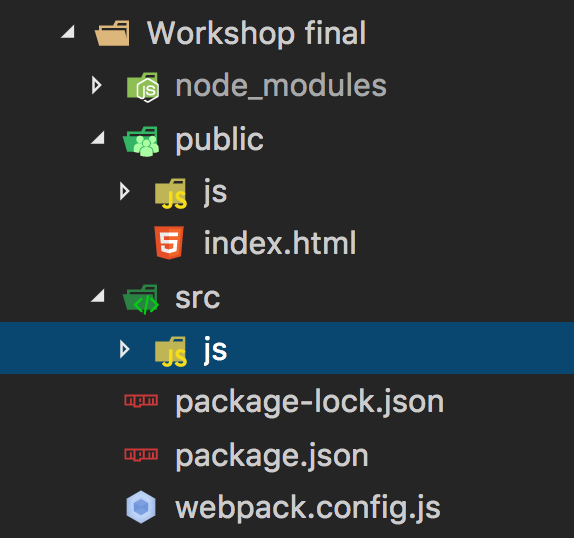

# 


Vamos a empezar a organizar nuestro proyecto para poder construir una SPA, para esto vamos a dividir nuestro proyecto en dos carpetas principales una `public` que va a contener lo que vamos a subir al servidor y otra `src` que va a tener los archivos previos a la subida al servidor. Similar a lo que hacíamos antes con SASS en el cual dividíamos entre los archivos `.scss` y el archivo `.css`.



npm init
npm install popper.js@^1.14.3
npm install jquery
npm install sammy
npm install boostrap
npm install --save-dev pushstate-server
npm install --save-dev nodemon

Hacer app con webpack 2:

`npm install --save-dev webpack webpack-cli`

```js
module.exports = {
  entry: [ './src/js/main.js', './src/js/main2.js' ],
  output: {
    path: __dirname + '/public/js/',
    filename: 'main.js'
  },
  watch: true
}
```